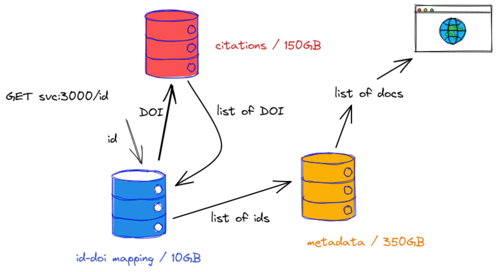

# A data web service

A data web service, lightning talk.

> [Leipzig Gophers](https://golangleipzig.space/)
> [#23](https://golangleipzig.space/posts/meetup-23-invitation/), 2021-11-23,
> 19:00 CET

A few notes on [KISS](https://en.wikipedia.org/wiki/KISS_principle),
[sqlite](https://sqlite.org) and Go (and [citation
graphs](https://arxiv.org/abs/2110.06595)) - from a recent
[project](https://github.com/miku/labe).

Outline:

* the data side
* the server side


## Starting point

* starting point was a project that should result in an API (queried by a
  frontend at [SLUB DD](https://www.slub-dresden.de/))
* fusing metadata from 200M documents (index) with graph data (citations, about 1B edges)

Outline and idea for a batch processing system existed - but would it be
feasible to fuse data on-the-fly at request time?


## KISS

> “Our aim,” he said, “is to get results cheaper, sooner, and better through
> application of common sense to tough problems. If it works, don’t fix it.”
> “Keep it simple, stupid—KISS—is our constant reminder.” -- [Biographical Memoir](http://www.nasonline.org/publications/biographical-memoirs/memoir-pdfs/johnson-clarence.pdf#page=13)

## Initial Import

The graph data looks like this - two columns, like an simple edge list:

    a b
    a c
    c d
    d e

Or for real:

    10.1016/j.trf.2016.11.009       10.1080/15389588.2014.1003818
    10.1016/j.ttbdis.2015.11.004    10.1186/1756-3305-5-194
    10.1016/j.urology.2009.04.090   10.1097/01.ju.0000180413.98752.a1
    10.1016/j.vetimm.2011.06.014    10.1038/nbt.1496
    10.1016/j.visres.2004.12.017    10.1002/1521-1878(200008)22:8<685::aid-bies1>3.0.co;2-c
    10.1016/j.wear.2016.01.004      10.1016/j.phpro.2015.11.048
    10.1016/j.ydbio.2010.11.017     10.1016/s0002-9440(10)63336-6
    10.1016/j.ygcen.2020.113526     10.1637/11097-042015-reg.1
    10.1016/j.ympev.2006.11.027     10.1111/j.0300-3256.2004.00160.x
    10.1016/s0002-8703(05)80031-6   10.1161/01.cir.79.4.756

There are 1,186,958,897 rows, 10GB compressed, 57GB uncompressed - we'll need
simple queries only, akin to a key value store, e.g. getting all values for a
key or all keys for a value.

## The most deployed database

First idea was to keep it simple and to load the TSV into
[sqlite](https://sqlite.org/index.html) - the [most
deployed](https://www.sqlite.org/mostdeployed.html) database on the planet.

A lesser known fact about sqlite:

> [sqlite](https://www.sqlite.org/locrsf.html) is a Recommended Storage Format
  for datasets according to the US Library of Congress (beside CSV, XML, JSON, etc.)

## Import data

* use `.mode tabs`
* using `.import` [command](https://sqlite.org/cli.html#importing_csv_files)

On first try, this worked well on a smaller dataset, but failed soon on the
bigger file; seemed that data would be loaded into memory first - and sqlite
got killed.

## Chop it up

* decided against implementing specific importing code through library

Minimal tool that:

* takes a two-column file
* breaks it up into smaller chunks (e.g. 64MB)
* spawns a sqlite3 call for each chunk and use `.import`

Data is [piped
into](https://github.com/miku/makta/blob/6dfae3bbd480bc330a30b53898b0562e8c7fbfb1/utils.go#L26-L56)
the subprocess' stdin from a buffer, reader:

```go
// RunImport reads data to be imported (e.g. two column TSV) from reader into a
// given database. Before importing, read commands from a given init file.
func RunImport(r io.Reader, initFile, outputFile string) (int64, error) {
	cmd := exec.Command("sqlite3", "--init", initFile, outputFile)
	cmdStdin, err := cmd.StdinPipe()
	if err != nil {
		return 0, err
	}
	var (
		wg      sync.WaitGroup // may use just chan bool
		copyErr error
		written int64
	)
	wg.Add(1)
	go func() {
		defer wg.Done()
		defer cmdStdin.Close()
		n, err := io.Copy(cmdStdin, r)
		if err != nil {
			copyErr = fmt.Errorf("copy failed: %w", err)
			return
		}
		written += n
	}()
	if _, err := cmd.CombinedOutput(); err != nil {
		return written, fmt.Errorf("exec failed: %w", err)
	}
	wg.Wait()
	return written, copyErr
}
```

## Performance

Tweak various [pragma](https://www.sqlite.org/pragma.html):

```sql
PRAGMA journal_mode = OFF;
PRAGMA synchronous = 0;
PRAGMA cache_size = 1000000;     -- x $(getconf PAGESIZE)
PRAGMA locking_mode = EXCLUSIVE;
```

> The `OFF journaling mode` disables the rollback journal completely. No rollback
> journal is ever created ...  On the other hand, commits can be orders of
> magnitude faster with `synchronous` OFF.

> `cache_size` ... maximum number of database disk pages that SQLite will hold
> in memory at once per open database file.

> There are three reasons to set the `locking-mode to EXCLUSIVE`.  ... The number
> of system calls for filesystem operations is reduced, possibly resulting in a
> small performance increase.

For query performance we'll need indices, too.

## Putting it all together

* minimal tool: [makta](https://github.com/miku/makta), turns (two column) TSV into an sqlite3 database

Example usage, 10M rows, 548MB file.

```
$ head fixtures/sample-10m.tsv # 548MB file
10.1001/amaguidesnewsletters.1996.novdec01      10.1016/s0363-5023(05)80265-5
10.1001/amaguidesnewsletters.1996.novdec01      10.1001/jama.1994.03510440069036
10.1001/amaguidesnewsletters.1997.julaug01      10.1097/00007632-199612150-00003
10.1001/amaguidesnewsletters.1997.mayjun01      10.1164/ajrccm/147.4.1056
10.1001/amaguidesnewsletters.1997.mayjun01      10.1136/thx.38.10.760
10.1001/amaguidesnewsletters.1997.mayjun01      10.1056/nejm199507133330207
10.1001/amaguidesnewsletters.1997.mayjun01      10.1378/chest.88.3.376
```

Create key-value database with both key and value indexed.

```
$ makta -version
makta 6dfae3b 2021-11-22T15:05:49Z

$ time makta -o data.db < fixtures/sample-10m.tsv
2021/11/22 16:06:57 [ok] initialized database · data.db
2021/11/22 16:07:11 [io] written 523M · 36.9M/s
2021/11/22 16:07:17 [ok] 1/2 created index · data.db
2021/11/22 16:07:35 [ok] 2/2 created index · data.db

real    0m38.339s
user    0m35.431s
sys     0m5.664s
```

Timings:

|               | elapsed (s)  | cumulative (s)    | rows/s    |
|-----------    |------------  |-----------------  |--------   |
| import        | 14           | 14                | 714,285   |
| index 1/2     | 6            | 20                | 500,000   |
| index 2/2     | 18           | 38                | 263,157   |

Not quite 1B rows per minute, but about 42,840,000 per minute w/o indexing.

* [https://lobste.rs/s/z4gahf/inserting_one_billion_rows_sqlite_under](https://lobste.rs/s/z4gahf/inserting_one_billion_rows_sqlite_under)

Oh, wait, was that just the headline?

> Inserting One Billion Rows in SQLite Under A Minute
> Current Best: 100M rows inserts in 33 seconds.
> Shouldn’t this blog post be called Inserting One Hundred Million Rows in
> SQLite Under A Minute?

Anyway, we can turn our original 1B dataset into a indexed database in 75
minutes.

## Web Service Outline

I found this useful:

* [How I write HTTP services after eight years.](https://pace.dev/blog/2018/05/09/how-I-write-http-services-after-eight-years.html)

A few things that I hear people ask:

* What is a good ORM for Go?

And I think ...

> Go feels like it isn't even half as productive compared to working with
> toolkits like SQLAlchemy, Diesel, Hibernate or ActiveRecord. -- [https://conroy.org/introducing-sqlc](https://conroy.org/introducing-sqlc)

There is something KISS in using plain SQL.

My current answer would be:

* plain [database/sql](https://pkg.go.dev/database/sql)
* [sqlx](https://github.com/jmoiron/sqlx)

Or, if you really want extra tooling:

* [sqlc](https://sqlc.dev/)

Anyway, I chose - again - [sqlx](https://github.com/jmoiron/sqlx).

## Web Service

So, KISS again.

* a couple of sqlite database (can be generated with e.g. makta or other tools)
* a slight abstraction over "fetching" index data, `Fetcher` (various implementation)
* a server holding connections to each of these database

```go
    // Setup server.
    srv := &ckit.Server{
        IdentifierDatabase:     identifierDatabase,
        OciDatabase:            ociDatabase,
        IndexData:              fetcher,
        Router:                 mux.NewRouter(),
        StopWatchEnabled:       *enableStopWatch,
        ...
    }
    ...
```

Methods are defined on the server, returning `http.HandlerFunc` values.

```go
type Server struct {
    IdentifierDatabase *sqlx.DB
    OciDatabase        *sqlx.DB
    IndexData          Fetcher
    // Router to register routes on.
    Router *mux.Router
    // StopWatch is a builtin, simplistic tracer.
    StopWatchEnabled bool
    ...
}

func (s *Server) handleIndex() http.HandlerFunc {
    return func(w http.ResponseWriter, r *http.Request) {
        // TODO: Render docs.
        fmt.Fprintf(w, "labed")
    }
}

...
```

## Performance again

The main work is done in a handler querying and fusing data from the currently
three different data stores. That method in short:

* *translates* an id to a "DOI", via `IdentifierDatabase`
* *looks* up edges related to that `DOI`, via `OciDatabase`
* *translates* all `DOI` back to local identifiers
* *looks* up all local idenfiers in the `Fetcher` datastore
* puts everything into a JSON file and sends it on the wire



<!--  -->

There is a bit of variance in the data, e.g. medium number of relevant edges is
about 10-20, with maximum of a few thousand edges for a few hundred of
documents.

In order to measure performance, wrote a little
[`StopWatch`](https://github.com/miku/labe/blob/main/go/ckit/stopwatch.go)
helper, a poor mans tracer, if you want.

```go
// StopWatch allows to record events over time and render them in a pretty
// table. Example log output (via stopwatch.LogTable()).
//
// 2021/09/29 17:22:40 timings for hTHc
//
// > XVlB    0    0s              0.00    started query for: ai-49-aHR0cDovL2R4L...
// > XVlB    1    134.532µs       0.00    found doi for id: 10.1210/jc.2011-0385
// > XVlB    2    67.918529ms     0.24    found 0 outbound and 4628 inbound edges
// > XVlB    3    32.293723ms     0.12    mapped 4628 dois back to ids
// > XVlB    4    3.358704ms      0.01    recorded unmatched ids
// > XVlB    5    68.636671ms     0.25    fetched 2567 blob from index data store
// > XVlB    6    105.771005ms    0.38    encoded JSON
// > XVlB    -    -               -       -
// > XVlB    S    278.113164ms    1.00    total
//
// By default a stopwatch is disabled, which means all functions will be noops,
// use SetEnabled to toggle mode.
```

Zero value works:

```go
var sw StopWatch
sw.Recordf("started query for: %s", vars["id"])
...
sw.Recordf("mapped %d dois back to ids", ss.Len())
sw.LogTable()
```

## Performance wrap up

* sqlite3 is amazing (total of about 500G database sizes)
* we get 100 requests/s sustained on a laptop
* for 99.% of the requests, we can serve queries in less than 170 ms

KISS benchmark via [pv](https://man7.org/linux/man-pages/man1/pv.1.html)

```shell
$ zstdcat -T0 go/ckit/fixtures/id-1m.tsv.zst | \
    parallel -j 40 "curl -s http://localhost:3000/id/{}" | pv -l > /dev/null
... [ 139 /s]
```

After a random sample of ~50K requests:

```python
In [1]: import pandas as pd

In [15]: df = pd.read_csv("took")

In [16]: df.describe()
Out[16]:
        0.000781515
count  53055.000000
mean       0.005550
std        0.017589
min        0.000000
25%        0.001004
50%        0.001800
75%        0.004285
max        1.048332

In [17]: df.quantile([.25, .5, .75, .95, .99, 1])
Out[17]:
      0.000781515
0.25     0.001004
0.50     0.001800
0.75     0.004285
0.95     0.019116
0.99     0.074674
1.00     1.048332
```

So, we have outliers that take over 1s, but 99% of requests are handled in 74ms
or less; dataset is relatively static and can be cached or warmed. Predicable
outliers.

## Summary

* two tools (makta, plus another hack)
* one server
* tracing helper
* three version of a data fetcher (microblob, sqlite3, solr)

In total 1612 lines of Go.

```shell
$ tokei go
===============================================================================
 Language            Files        Lines         Code     Comments       Blanks
===============================================================================
 Go                      9         1612         1136          358          118
 Makefile                1           32           26            0            6
 Markdown                3          401            0          306           95
 Python                  1           30            4           22            4
===============================================================================
 Total                  14         2075         1166          686          223
===============================================================================
```

Simplicity is joy.


## Thanks

Credits:

* [https://etc.usf.edu/clipart/](https://etc.usf.edu/clipart/)
* [https://github.com/excalidraw/excalidraw](https://github.com/excalidraw/excalidraw)
